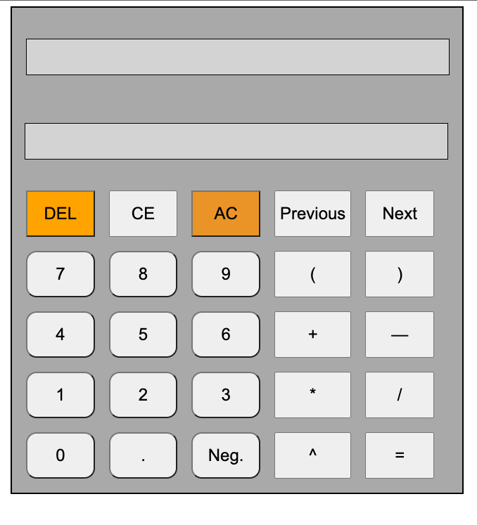

# Vanilla Javascript Calculator

*Simple calculator written in pure Javascript, HTML & CSS*

Use it [Here](https://lboecken.github.io/fantastic-octo-funicular/)

## Summary

A simple calculator that enforces order of operations and handles addition/subtraction, multiplication/division, exponents and parentheses. It stores input and output values in memory automatically and they can be accessed using the ‘Previous’ / ‘Next’ buttons. 

The calculator implements the Shunting-Yard Algorithm to convert infix (standard) math notation to postfix where it then evaluates expressions. This helps enforce the order of operation with less lines of code. 

## Author
Lennart Boecken
